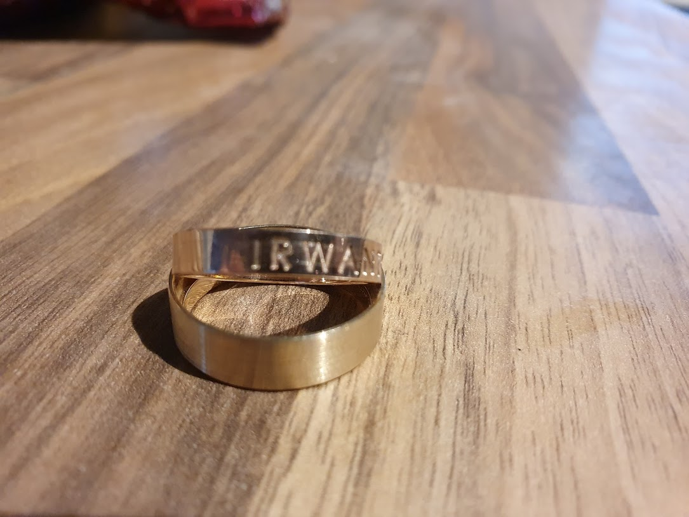

# About

The repository contains the code for [irwantowski.com](http://irwantowski.com) - the shared
website of Kamil Janowski and Christabella Irwanto who got married, got a domain engraved on their wedding 
rings and decided to build the wackiest website of them all.

# Build and dev

Lol... no build. No time for this.
It's just vanilla JS combined from a number of random opensource examples we found.
The lack of code cleanups adds up to the overall wackiness.